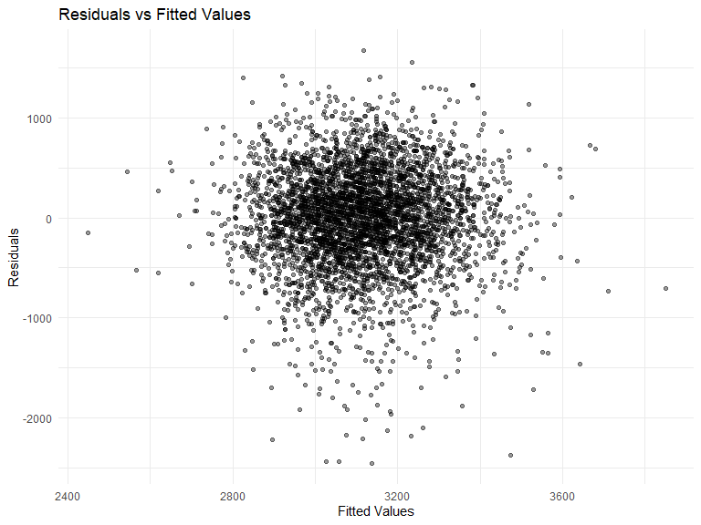

Homework 6
================
Julia Thompson
11/20/2019

## Problem 1

Load and clean the data for regression analysis (i.e. convert numeric to
factor where appropriate, check for missing data, etc.).

We load and clean the data for regression analysis, and find that there
are no missing values in any of the columns. We also recode and convert
*babysex*, *frace*, *malform*, and *mrace* to factor variables.

``` r
birthweight = read_csv("./data/birthweight.csv") 
```

    ## Parsed with column specification:
    ## cols(
    ##   .default = col_double()
    ## )

    ## See spec(...) for full column specifications.

``` r
# check for missing data

ismissing = map(.x = birthweight, ~ sum(is.na(.x))) %>%  # why do you need the ~ ?!?
  bind_cols()

# male = 1, female = 2
# 1 = White, 2 = Black, 3 = Asian, 4 = Puerto Rican, 8 = Other, 9 = Unknown
# 0 = absent, 1 = present
# 1 = White, 2 = Black, 3 = Asian, 4 = Puerto Rican, 8 = Other

# Recode variables to make sense

birthweight = birthweight %>% 
  mutate(
    babysex = recode(babysex, `1` = "male", `2` = "female"),
    frace = recode(frace, `1` = "white", `2` = "black", `3` = "asian", `4` = "puerto rican", `8` = "other", `9` = "unknown"),
    malform = recode(malform, `0` = "absent", `1` = "present"),
    mrace = recode(mrace,  `1` = "white", `2` = "black", `3` = "asian", `4` = "puerto rican", `8` = "other")
  )

# change the above recoded variables into factors with levels corresponding to the above order

birthweight = birthweight %>% 
  mutate(
    babysex = factor(babysex, levels = c("male", "female")),
    frace = factor(frace, levels = c("white", "black", "asian", "puerto rican", "other", "unknown")),
    malform = factor(malform, levels = c("absent", "present")),
    mrace = factor(mrace, levels = c("white", "black", "asian", "puerto rican", "other"))
  )
```

Propose a regression model for birthweight. This model may be based on a
hypothesized structure for the factors that underly birthweight, on a
data-driven model-building process, or a combination of the two.
Describe your modeling process and show a plot of model residuals
against fitted values – use add\_predictions and add\_residuals in
making this plot.

We used a hypothesized structure consulting literature for the factors
that underly birthweight to reduce our number of potential predictors.
We will continue with the following: gender (*babysex*), mother’s BMI
(*ppbmi*), mother’s height (*mheigth*), cigarettes smoked per day
(*smoken*), and mother’s age (*momage*). We chose a final model by
fitting an interaction term between mother’s age and number of
cigarettes smoked per day, as indicated by past research. Because the
interaction term is significant and there is evidence in the literature
of interaction between age and smoking, we will keep the interaction in
our final model. We then create a plot of residuals vs fitted values and
find that our points are centered around 0 with no clear patterns that
would be
problematic.

``` r
# interaction between smoking status and age - this interaction term is significant, so we will keep this as our final model

interaction_model = lm(bwt ~ babysex + ppbmi + mheight + momage*smoken, data = birthweight) 
summary(interaction_model)
```

    ## 
    ## Call:
    ## lm(formula = bwt ~ babysex + ppbmi + mheight + momage * smoken, 
    ##     data = birthweight)
    ## 
    ## Residuals:
    ##      Min       1Q   Median       3Q      Max 
    ## -2456.93  -268.89    23.88   312.92  1673.35 
    ## 
    ## Coefficients:
    ##               Estimate Std. Error t value Pr(>|t|)    
    ## (Intercept)     9.2435   193.5797   0.048  0.96192    
    ## babysexfemale -87.2849    14.9350  -5.844 5.46e-09 ***
    ## ppbmi          17.1699     2.3666   7.255 4.73e-13 ***
    ## mheight        38.3209     2.8463  13.464  < 2e-16 ***
    ## momage         18.2511     2.1579   8.458  < 2e-16 ***
    ## smoken         13.0265     5.0494   2.580  0.00992 ** 
    ## momage:smoken  -0.9308     0.2316  -4.018 5.97e-05 ***
    ## ---
    ## Signif. codes:  0 '***' 0.001 '**' 0.01 '*' 0.05 '.' 0.1 ' ' 1
    ## 
    ## Residual standard error: 491.3 on 4335 degrees of freedom
    ## Multiple R-squared:  0.08112,    Adjusted R-squared:  0.07985 
    ## F-statistic: 63.78 on 6 and 4335 DF,  p-value: < 2.2e-16

``` r
# show a plot of residuals vs fitted

birthweight = 
  birthweight %>% 
  add_residuals(interaction_model) %>% 
  add_predictions(interaction_model)

# residuals are clustered, but there is no clear pattern... seems ok enough to proceed

ggplot(birthweight, aes(x = pred, y = resid))+
  geom_point()
```



Compare your model to two others:

One using length at birth and gestational age as predictors (main
effects only) One using head circumference, length, sex, and all
interactions (including the three-way interaction) between these

``` r
simple_model_given = lm(bwt ~ blength + gaweeks, data = birthweight)
summary(simple_model_given)
```

    ## 
    ## Call:
    ## lm(formula = bwt ~ blength + gaweeks, data = birthweight)
    ## 
    ## Residuals:
    ##     Min      1Q  Median      3Q     Max 
    ## -1709.6  -215.4   -11.4   208.2  4188.8 
    ## 
    ## Coefficients:
    ##              Estimate Std. Error t value Pr(>|t|)    
    ## (Intercept) -4347.667     97.958  -44.38   <2e-16 ***
    ## blength       128.556      1.990   64.60   <2e-16 ***
    ## gaweeks        27.047      1.718   15.74   <2e-16 ***
    ## ---
    ## Signif. codes:  0 '***' 0.001 '**' 0.01 '*' 0.05 '.' 0.1 ' ' 1
    ## 
    ## Residual standard error: 333.2 on 4339 degrees of freedom
    ## Multiple R-squared:  0.5769, Adjusted R-squared:  0.5767 
    ## F-statistic:  2958 on 2 and 4339 DF,  p-value: < 2.2e-16

``` r
complex_model_given = lm(bwt ~ babysex * bhead * blength, data = birthweight)
summary(complex_model_given)
```

    ## 
    ## Call:
    ## lm(formula = bwt ~ babysex * bhead * blength, data = birthweight)
    ## 
    ## Residuals:
    ##      Min       1Q   Median       3Q      Max 
    ## -1132.99  -190.42   -10.33   178.63  2617.96 
    ## 
    ## Coefficients:
    ##                               Estimate Std. Error t value Pr(>|t|)    
    ## (Intercept)                 -7176.8170  1264.8397  -5.674 1.49e-08 ***
    ## babysexfemale                6374.8684  1677.7669   3.800 0.000147 ***
    ## bhead                         181.7956    38.0542   4.777 1.84e-06 ***
    ## blength                       102.1269    26.2118   3.896 9.92e-05 ***
    ## babysexfemale:bhead          -198.3932    51.0917  -3.883 0.000105 ***
    ## babysexfemale:blength        -123.7729    35.1185  -3.524 0.000429 ***
    ## bhead:blength                  -0.5536     0.7802  -0.710 0.478012    
    ## babysexfemale:bhead:blength     3.8781     1.0566   3.670 0.000245 ***
    ## ---
    ## Signif. codes:  0 '***' 0.001 '**' 0.01 '*' 0.05 '.' 0.1 ' ' 1
    ## 
    ## Residual standard error: 287.7 on 4334 degrees of freedom
    ## Multiple R-squared:  0.6849, Adjusted R-squared:  0.6844 
    ## F-statistic:  1346 on 7 and 4334 DF,  p-value: < 2.2e-16

<http://web.b.ebscohost.com/ehost/pdfviewer/pdfviewer?vid=1&sid=d6056f5b-5ea8-4211-8071-e675375944e1%40pdc-v-sessmgr04>
