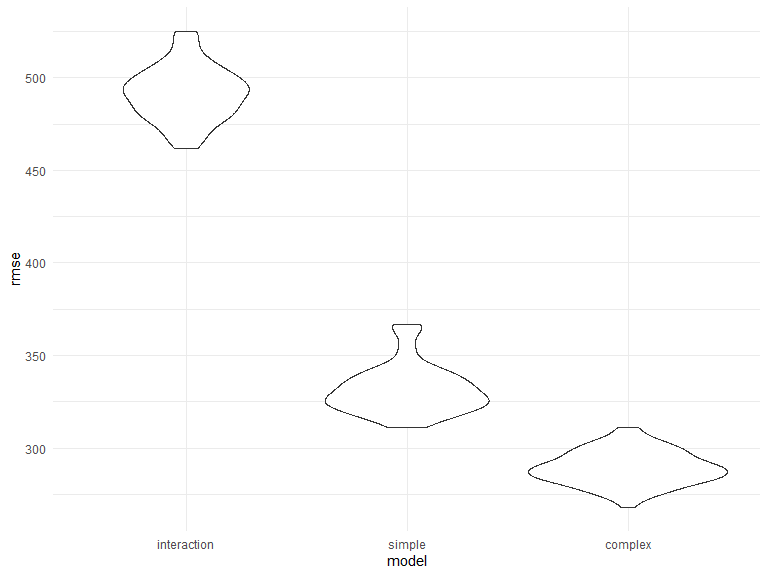
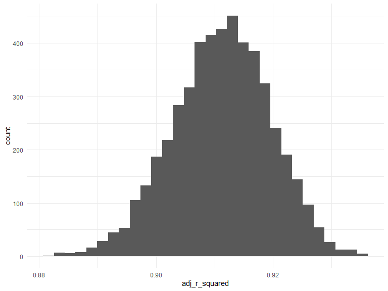
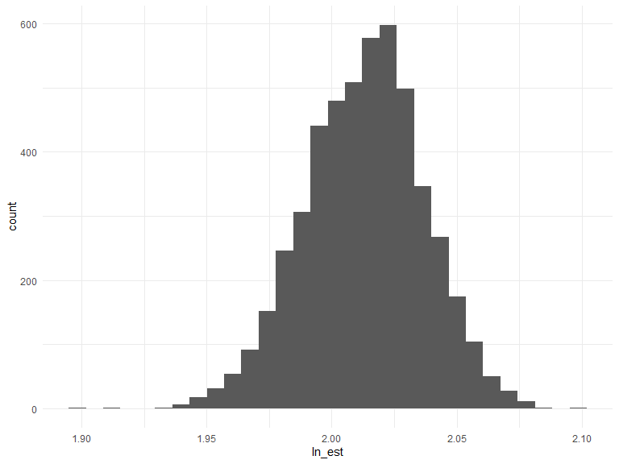

Homework 6
================
Julia Thompson
11/20/2019

## Problem 1

We load and clean the data for regression analysis, and find that there
are no missing values in any of the columns. We also recode and convert
*babysex*, *frace*, *malform*, and *mrace* to factor variables.

``` r
birthweight = read_csv("./data/birthweight.csv") 
```

    ## Parsed with column specification:
    ## cols(
    ##   .default = col_double()
    ## )

    ## See spec(...) for full column specifications.

``` r
ismissing = map(.x = birthweight, ~ sum(is.na(.x))) %>%  
  bind_cols()

# Recode variables to make sense

birthweight = birthweight %>% 
  mutate(
    babysex = recode(babysex, `1` = "male", `2` = "female"),
    frace = recode(frace, `1` = "white", `2` = "black", `3` = "asian", `4` = "puerto rican", `8` = "other", `9` = "unknown"),
    malform = recode(malform, `0` = "absent", `1` = "present"),
    mrace = recode(mrace,  `1` = "white", `2` = "black", `3` = "asian", `4` = "puerto rican", `8` = "other")
  )

# change the above recoded variables into factors with levels corresponding to the above order

birthweight = birthweight %>% 
  mutate(
    babysex = factor(babysex, levels = c("male", "female")),
    frace = factor(frace, levels = c("white", "black", "asian", "puerto rican", "other", "unknown")),
    malform = factor(malform, levels = c("absent", "present")),
    mrace = factor(mrace, levels = c("white", "black", "asian", "puerto rican", "other"))
  )
```

We used a hypothesized structure consulting literature for the factors
that underly birthweight to reduce our number of potential predictors.
We will continue with the following: gender (*babysex*), mother’s BMI
(*ppbmi*), mother’s height (*mheigth*), cigarettes smoked per day
(*smoken*), and mother’s age (*momage*). We chose a final model by
fitting an interaction term between mother’s age and number of
cigarettes smoked per day, as indicated by past research. Because the
interaction term is significant and there is evidence in the literature
of interaction between age and smoking, we will keep the interaction in
our final model. We then create a plot of residuals vs fitted values and
find that our points are centered around 0 with no clear patterns that
would be
problematic.

``` r
# interaction between smoking status and age - this interaction term is significant, so we will keep this as our final model

interaction_model = lm(bwt ~ babysex + ppbmi + mheight + momage*smoken, data = birthweight) 
summary(interaction_model)
```

    ## 
    ## Call:
    ## lm(formula = bwt ~ babysex + ppbmi + mheight + momage * smoken, 
    ##     data = birthweight)
    ## 
    ## Residuals:
    ##      Min       1Q   Median       3Q      Max 
    ## -2456.93  -268.89    23.88   312.92  1673.35 
    ## 
    ## Coefficients:
    ##               Estimate Std. Error t value Pr(>|t|)    
    ## (Intercept)     9.2435   193.5797   0.048  0.96192    
    ## babysexfemale -87.2849    14.9350  -5.844 5.46e-09 ***
    ## ppbmi          17.1699     2.3666   7.255 4.73e-13 ***
    ## mheight        38.3209     2.8463  13.464  < 2e-16 ***
    ## momage         18.2511     2.1579   8.458  < 2e-16 ***
    ## smoken         13.0265     5.0494   2.580  0.00992 ** 
    ## momage:smoken  -0.9308     0.2316  -4.018 5.97e-05 ***
    ## ---
    ## Signif. codes:  0 '***' 0.001 '**' 0.01 '*' 0.05 '.' 0.1 ' ' 1
    ## 
    ## Residual standard error: 491.3 on 4335 degrees of freedom
    ## Multiple R-squared:  0.08112,    Adjusted R-squared:  0.07985 
    ## F-statistic: 63.78 on 6 and 4335 DF,  p-value: < 2.2e-16

``` r
# show a plot of residuals vs fitted

birthweight = 
  birthweight %>% 
  add_residuals(interaction_model) %>% 
  add_predictions(interaction_model)

# residuals are clustered, but there is no clear pattern... seems ok enough to proceed

ggplot(birthweight, aes(x = pred, y = resid))+
  geom_point()
```


We compare the above model to two others using cross validation:

  - One using length at birth and gestational age as predictors (main
    effects only)
  - One using head circumference, length, sex, and all interactions
    (including the three-way interaction) between these

<!-- end list -->

``` r
# This is just for me to think about it 

# simple_model_given = lm(bwt ~ blength + gaweeks, data = birthweight)
# summary(simple_model_given)
#   
# complex_model_given = lm(bwt ~ babysex * bhead * blength, data = birthweight)
# summary(complex_model_given)
```

Make this comparison in terms of the cross-validated prediction error;
use crossv\_mc and functions in purrr as appropriate.

``` r
# need to create testing and training datasets to use on all 3 models.

cv_df = crossv_mc(birthweight, 100)

cv_df = cv_df %>% 
  mutate(
    train = map(train, as_tibble),
    test = map(test, as_tibble)
  )
```

``` r
# Now fit the respective models to each

cv_df = 
  cv_df %>% 
  mutate(interaction_model = map(train, ~lm(bwt ~ babysex + ppbmi + mheight + momage * smoken, data = .x)),
         simple_model_given = map(train, ~lm(bwt ~ blength + gaweeks, data = .x)),
         complex_model_given = map(train, ~lm(bwt ~ babysex * bhead * blength, data = .x))) %>% 
  mutate(rmse_interaction = map2_dbl(interaction_model, test, ~rmse(model = .x, data = .y)),
         rmse_simple = map2_dbl(simple_model_given, test, ~rmse(model = .x, data = .y)),
         rmse_complex = map2_dbl(complex_model_given, test, ~rmse(model = .x, data = .y)))

cv_df %>% 
  select(starts_with("rmse")) %>% 
  pivot_longer(
    everything(),
    names_to = "model", 
    values_to = "rmse",
    names_prefix = "rmse_") %>% 
  mutate(model = fct_inorder(model)) %>% 
  ggplot(aes(x = model, y = rmse)) + geom_violin()
```



<http://web.b.ebscohost.com/ehost/pdfviewer/pdfviewer?vid=1&sid=d6056f5b-5ea8-4211-8071-e675375944e1%40pdc-v-sessmgr04>

## Problem 2

``` r
weather_df = 
  rnoaa::meteo_pull_monitors(
    c("USW00094728"),
    var = c("PRCP", "TMIN", "TMAX"), 
    date_min = "2017-01-01",
    date_max = "2017-12-31") %>%
  mutate(
    name = recode(id, USW00094728 = "CentralPark_NY"),
    tmin = tmin / 10,
    tmax = tmax / 10) %>%
  select(name, id, everything())
```

    ## Registered S3 method overwritten by 'crul':
    ##   method                 from
    ##   as.character.form_file httr

    ## Registered S3 method overwritten by 'hoardr':
    ##   method           from
    ##   print.cache_info httr

    ## file path:          C:\Users\jbenn\AppData\Local\rnoaa\rnoaa\Cache/ghcnd/USW00094728.dly

    ## file last updated:  2019-09-26 10:36:48

    ## file min/max dates: 1869-01-01 / 2019-09-30

We’ll focus on a simple linear regression with tmax as the response and
tmin as the predictor.

We will use 5000 bootstrap samples and, for each bootstrap sample,
produce estimates of

$ ^2  log( \* ) $

``` r
bootstrap = 
  weather_df %>% 
  modelr::bootstrap(n = 5000) %>% 
  mutate(
    models = map(strap, ~lm(tmax ~ tmin, data = .x))
  )

output = 
  bootstrap %>% 
  mutate(
    results_ln = map(models, broom::tidy),
    results_rsq = map(models, broom::glance)
    ) %>% 
  select(-strap, -models) %>% 
  unnest(results_ln, results_rsq) %>% 
  select(.id, term, estimate, adj.r.squared) %>% 
  pivot_wider(
    names_from = term, 
    values_from = estimate
  ) %>% 
  janitor::clean_names() %>% 
  mutate(
    ln_est = log(intercept * tmin)
  ) %>% 
  select(adj_r_squared, ln_est)
```

Plot the distribution of your estimates, and describe these in words.

``` r
ggplot(output, aes(x = adj_r_squared))+
  geom_histogram()
```

    ## `stat_bin()` using `bins = 30`. Pick better value with `binwidth`.



``` r
ggplot(output, aes(x = ln_est))+
  geom_histogram()
```

    ## `stat_bin()` using `bins = 30`. Pick better value with `binwidth`.



Using the 5000 bootstrap estimates, identify the 2.5% and 97.5%
quantiles to provide a 95% confidence interval

``` r
conf_int = output %>% 
  summarize(
    lower_rsq = quantile(adj_r_squared, .025),
    upper_rsq = quantile(adj_r_squared, .975),
    lower_ln = quantile(ln_est, .025),
    upper_ln = quantile(ln_est, .975)
  ) %>% 
  pivot_longer(
    cols = lower_rsq:upper_ln,
    names_to = "Estimate",
    values_to = c("Lower", "Upper"),
    names_prefix = c("lower_", "upper_")
  ) %>% 
  mutate(
    Estimate = recode(Estimate, "rsq" = "R Hat Squared", "ln" = "Log Beta Hat")
  )

conf_int %>% knitr::kable()
```

| Estimate      |     Lower |     Upper |
| :------------ | --------: | --------: |
| R Hat Squared | 0.8937842 | 0.9275565 |
| Log Beta Hat  | 1.9625974 | 2.0583173 |
